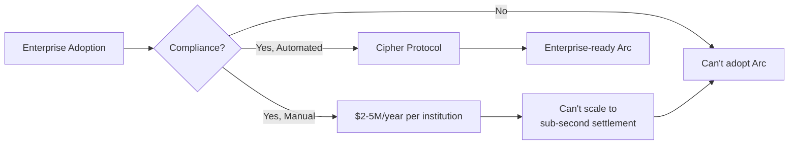
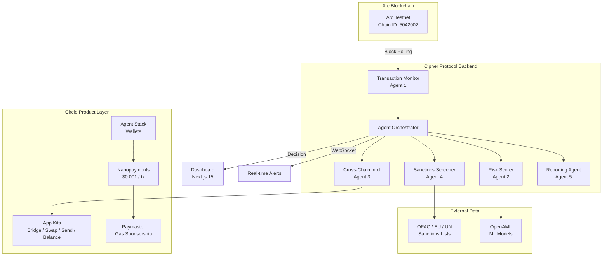
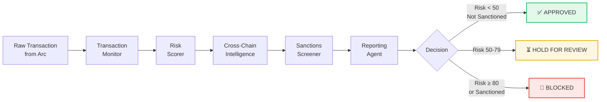
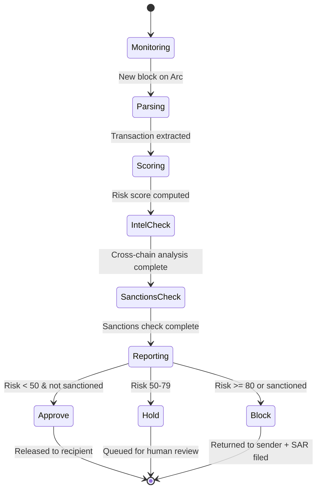
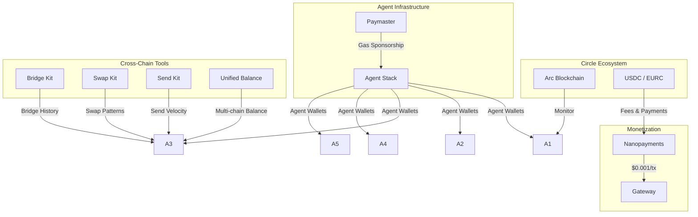
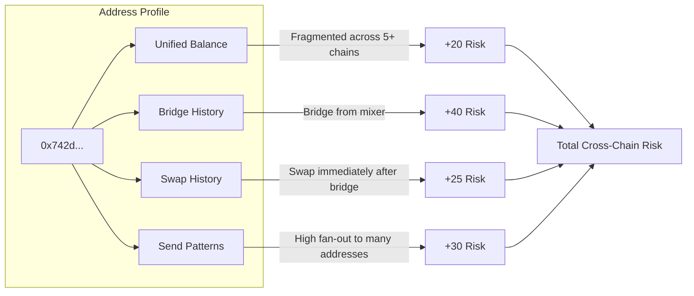

# Cipher Protocol

> **Autonomous AML/KYC Compliance for the Arc Blockchain**  
> Built for the [Agentic Economy on Arc Hackathon](https://www.encodeclub.com/programmes/arc-hackathon) by Encode Club

<div align="center">

[](https://opensource.org/licenses/MIT)
[](https://testnet.arcscan.app)
[](https://circle.com)
[](https://fastapi.tiangolo.com)
[](https://nextjs.org)
[](https://python.org)
[](https://github.com/Marvy247/Cipher-Protocol/pulls)

</div>

---

## Table of Contents

- [Overview](#overview)
- [The Problem](#the-problem)
- [Architecture](#architecture)
- [The Five Autonomous Agents](#the-five-autonomous-agents)
- [Decision Pipeline](#decision-pipeline)
- [Circle Product Integration](#circle-product-integration)
- [Cross-Chain Intelligence](#cross-chain-intelligence)
- [Tech Stack](#tech-stack)
- [Project Structure](#project-structure)
- [Quick Start](#quick-start)
- [Demo Scenarios](#demo-scenarios)
- [API Reference](#api-reference)
- [Environment Variables](#environment-variables)
- [Development](#development)
- [License](#license)

---

## Overview

Cipher Protocol is the **first autonomous AML/KYC compliance system purpose-built for stablecoin transactions on Arc**. It deploys five specialized AI agents that work in concert to monitor, score, screen, and report on every transaction in real-time — enabling enterprise adoption of Arc without the prohibitive cost of manual compliance teams.

**For enterprise decision-makers:**
Compliance is the #1 barrier to institutional stablecoin adoption. Cipher Protocol replaces $2–5M/year manual compliance operations with an autonomous agent system costing <$50K/year — a **49x ROI** — while meeting OFAC, EU, and UN regulatory requirements. [See enterprise case studies →](./docs/CASE_STUDIES.md)

**Key capabilities:**

| Capability | Detail |
|---|---|
| **Real-time monitoring** | Sub-500ms processing per transaction |
| **Risk scoring** | ML-powered (OpenAML) scores from 0–100 |
| **Cross-chain intel** | Simulated multi-chain risk analysis (live Circle App Kits integration planned) |
| **Sanctions screening** | OFAC, EU, and UN list checking |
| **Auto-reporting** | Autonomous SAR generation and filing |
| **Cost efficiency** | ~99.5% cost reduction vs. traditional compliance |

> **What's real vs. simulated:** The dashboard transaction stream uses demo data to visualize the pipeline, but the **On-Chain Proof** feed, **agent wallets**, and every **$0.001 USDC nanopayment** are real Arc Testnet transactions — each verifiable on Arcscan. Cross-chain App Kits data is simulated until a Circle API key is provisioned.

---

## The Problem

Circle has identified enterprise adoption as the #1 strategic priority for Arc. However, **regulatory compliance is the primary barrier** preventing financial institutions from adopting stablecoin infrastructure:



- **Cost**: Manual AML/KYC teams cost enterprises $2–5M annually
- **Speed**: Human review cannot match Arc's sub-second settlement finality
- **Complexity**: Cross-chain transaction patterns (bridges, mixers, swaps) are impossible to track manually across 8+ chains
- **Coverage**: Sanctions lists change daily — no manual team can keep pace

---

## Architecture



### How it works

1. **Arc Connector** polls the Arc Testnet RPC for new blocks and transactions
2. Each transaction is passed through the **5-agent pipeline** orchestrated by `AgentOrchestrator`
3. Every agent makes an independent decision; the orchestrator aggregates results into a final verdict
4. Results are streamed to the dashboard via **WebSocket** for real-time visualization
5. All agent decisions and evidence are logged to an **immutable audit trail**

---

## The Five Autonomous Agents



### Agent 1: Transaction Monitor
Validates incoming transactions from the Arc blockchain. Flags anomalous patterns including large amounts (>$100K), contract creations, out-of-hours activity, and rapid-fire sequences.

**Input**: Raw Arc transaction  
**Output**: Validated transaction with anomaly flags  
**File**: [`agents/transaction_monitor.py`](./agents/transaction_monitor.py)

### Agent 2: Risk Scorer
Applies a machine learning model built on FINOS OpenAML research to compute a risk score from 0 (safe) to 100 (critical). Uses feature engineering (transaction amount, velocity, time patterns, historical behavior) and an XGBoost classifier.

| Score Range | Level | Action |
|---|---|---|
| 0–24 | Low | Auto-approve |
| 25–49 | Medium | Enhanced monitoring |
| 50–79 | High | Hold for review |
| 80–100 | Critical | Block |

**Input**: Validated transaction + anomaly flags  
**Output**: Risk score + confidence interval  
**Files**: [`agents/risk_scorer.py`](./agents/risk_scorer.py), [`ml/`](./ml/)

### Agent 3: Cross-Chain Intelligence
Simulates tracing wallet activity across multiple blockchains (bridge, swap, and send patterns) to detect sophisticated laundering patterns that single-chain monitors miss. Designed to consume Circle App Kits data — live integration pending API access.

> See [Cross-Chain Intelligence](#cross-chain-intelligence) for details.

**Input**: Sender/recipient addresses  
**Output**: Cross-chain risk assessment  
**File**: [`agents/cross_chain_intel.py`](./agents/cross_chain_intel.py)

### Agent 4: Sanctions Screener
Checks every sender and recipient address against the latest OFAC, EU, and UN sanctions lists. Maintains a local cache updated via daily CI/CD pipeline.

**Input**: Addresses + sanctions lists  
**Output**: Sanctions match result (pass / fail)  
**File**: [`agents/sanctions_screener.py`](./agents/sanctions_screener.py)

### Agent 5: Reporting Agent
Auto-generates Suspicious Activity Reports (SARs) for flagged transactions and periodic compliance reports. SARs are saved as structured JSON to `data/sars/`.

**Input**: All agent decisions + evidence  
**Output**: SAR document or compliance report  
**File**: [`agents/reporting_agent.py`](./agents/reporting_agent.py)

---

## Decision Pipeline



---

## Circle Product Integration

Cipher Protocol achieves deep, meaningful integration across the entire Circle product suite — each product serves a specific purpose in the compliance pipeline.



| Product | Purpose | Integration Point |
|---|---|---|
| **Arc** | Primary blockchain for transaction monitoring | `integrations/arc_connector.py` |
| **USDC** | Compliance fee denomination and agent payments | `integrations/contracts.py` |
| **Agent Stack** | Dedicated wallets for each of the 5 agents | `integrations/agent_stack.py` |
| **Bridge Kit** | Detect bridge transactions and layering patterns | `integrations/app_kits.py` |
| **Unified Balance** | Analyze wallet balances across Arc, Ethereum, Base | `integrations/app_kits.py` |
| **Swap Kit** | Detect USDC/EURC swap structuring (smurfing) | `integrations/app_kits.py` |
| **Send Kit** | Track payment velocity and fan-out patterns | `integrations/app_kits.py` |
| **Nanopayments** | $0.001 per-transaction compliance fee via Gateway | `integrations/nanopayments.py` |
| **Paymaster** | Gas sponsorship for agent transactions | Referenced in agent stack |

---

## Cross-Chain Intelligence

The **Cross-Chain Intelligence Agent** (Agent 3) builds a multi-chain profile for every address involved in a transaction. It is architected around Circle App Kits (Unified Balance, Bridge Kit, Swap Kit, Send Kit); in the current build these queries are simulated with realistic risk heuristics until a Circle API key is provisioned.



**Risk flags detected:**

| Pattern | Risk Contribution | Detection Method |
|---|---|---|
| Balance fragmented across 5+ chains | +20 | App Kit Unified Balance (simulated) |
| Bridge originating from known mixer | +40 | App Kit Bridge History (simulated) |
| Swap immediately after bridging | +25 | App Kit Swap Kit timestamps (simulated) |
| High fan-out (1-to-many sends) | +30 | Send Kit velocity analysis (simulated) |
| Structuring (multiple small txs) | +35 | Time-based pattern analysis |
| Interaction with sanctioned addresses | +50 | Cross-referenced via sanctions lists |

This gives Cipher Protocol **detection capabilities that no single-chain compliance system can achieve**.

---

## Tech Stack

### Backend
| Technology | Purpose |
|---|---|
| **Python 3.10+** | Core language |
| **FastAPI** | REST API + WebSocket server |
| **LangGraph** | Agent orchestration pipeline |
| **Web3.py** | Arc RPC communication |
| **scikit-learn / XGBoost** | ML risk scoring models |
| **OpenAML (FINOS)** | Open-source AML research models |
| **Pydantic** | Settings & data validation |
| **SQLAlchemy** | Database ORM (compliance audit trail) |

### Frontend
| Technology | Purpose |
|---|---|
| **Next.js 15** | React framework with App Router |
| **TypeScript** | Type-safe codebase |
| **TailwindCSS 3** | Utility-first styling |
| **shadcn/ui** | Accessible component primitives |
| **Framer Motion** | Page and UI animations |
| **Recharts** | Compliance metrics charts |
| **Zustand** | Client-side state management |
| **Zod** | Form and API validation |
| **Sonner** | Toast notifications |

### Infrastructure
| Technology | Purpose |
|---|---|
| **Arc Testnet** | Blockchain monitoring target (real blocks + on-chain fees) |
| **Circle Agent Stack** | Agent wallet infrastructure (5 funded on-chain wallets) |
| **Circle App Kits** | Simulated cross-chain data (integration planned) |
| **Docker Compose** | Local development orchestration |
| **GitHub Actions** | CI/CD pipeline |
| **Vercel** | Frontend deployment |

---

## Project Structure

```
cipher-protocol/
├── agents/                       # Multi-agent compliance system
│   ├── base_agent.py             # Abstract base class
│   ├── transaction_monitor.py    # Agent 1: Transaction validation
│   ├── risk_scorer.py            # Agent 2: ML risk scoring
│   ├── cross_chain_intel.py      # Agent 3: Circle App Kits analysis
│   ├── sanctions_screener.py     # Agent 4: OFAC/EU/UN checks
│   ├── reporting_agent.py        # Agent 5: SAR generation
│   └── orchestrator.py           # Agent coordinator & decision logic
│
├── backend/                      # FastAPI server
│   ├── api/routes.py             # REST endpoints (7 routes)
│   ├── config/settings.py        # Pydantic settings (env-based)
│   ├── main.py                   # App entry point + lifespan
│   ├── websocket.py              # Real-time WebSocket manager
│   └── requirements.txt          # Python dependencies
│
├── dashboard/                    # Next.js 15 frontend
│   ├── app/                      # App Router pages
│   │   ├── page.tsx              # Landing page
│   │   ├── login/page.tsx        # Authentication
│   │   └── dashboard/page.tsx    # Compliance monitor
│   ├── components/               # React components
│   │   ├── landing/              # Landing page sections
│   │   └── ui/                   # shadcn/ui primitives
│   ├── lib/api.ts                # Backend API client
│   └── hooks/use-realtime.ts     # WebSocket hook
│
├── data/                         # Data storage layer
│   ├── audit_logs.py             # Immutable audit trail
│   ├── sanctions_lists.py        # Sanctions data loader
│   ├── transaction_store.py      # TX storage & stats
│   └── sars/                     # Generated SAR documents
│
├── integrations/                 # Circle/Arc integration layer
│   ├── arc_connector.py          # Arc RPC & block monitoring
│   ├── agent_stack.py            # Circle Agent Stack wallets
│   ├── app_kits.py               # Bridge/Swap/Send/Balance
│   ├── contracts.py              # USDC/EURC ABIs
│   └── nanopayments.py           # $0.001 compliance fee
│
├── ml/                           # Machine learning engine
│   ├── feature_engineering.py    # Feature extraction pipeline
│   ├── openaml_adapter.py        # OpenAML model wrapper
│   └── risk_models.py            # XGBoost risk classifier
│
├── scripts/                      # Utility scripts
│   ├── demo_data.py              # Synthetic data generator
│   ├── demo_scenarios.py         # 5 demo scenario runner
│   ├── deploy.sh                 # Production deployment
│   └── setup.sh                  # Environment setup
│
├── tests/                        # Test suite
│   ├── test_agents.py            # Agent unit tests
│   └── test_arc_connection.py    # Arc RPC integration tests
│
├── docs/                         # Documentation
│   ├── AGENT_WORKFLOW.md         # Agent pipeline deep-dive
│   ├── API_REFERENCE.md          # Full API documentation
│   └── DEPLOYMENT.md             # Deployment guide
│
├── docker-compose.yml            # Docker orchestration
├── .env.example                  # Environment template
└── LICENSE                       # MIT license
```

---

## Quick Start

### Prerequisites

- Node.js 18+
- Python 3.10+
- pnpm (`npm install -g pnpm`)
- Arc Testnet wallet with test USDC (faucet at [Arc Testnet Faucet](https://testnet.arcscan.app/faucet))

### Setup

```bash
# Clone the repository
git clone https://github.com/Marvy247/Cipher-Protocol.git
cd Cipher-Protocol

# Configure environment
cp .env.example .env
# Edit .env with your API keys and wallet credentials

# Install and start the backend
cd backend
python -m venv venv
source venv/bin/activate   # Windows: venv\Scripts\activate
pip install -r requirements.txt
python main.py              # Runs on http://localhost:8000

# In a new terminal — install and start the dashboard
cd dashboard
pnpm install
pnpm dev                    # Runs on http://localhost:3000
```

### Docker

```bash
docker compose up --build
```

### Verify it's running

```bash
# Backend health check
curl http://localhost:8000/health
# → {"status": "healthy"}

# Agent status
curl http://localhost:8000/api/v1/agents/status
# → {"agents": [{"name": "TransactionMonitor", "status": "active"}, ...]}

# Open the dashboard
open http://localhost:3000
```

---

## Demo Scenarios

Run the demo script to see all five agents in action:

```bash
cd scripts
python demo_scenarios.py
```

### Scenario 1: Normal Transaction ✅

```
Amount:    $5,000 USDC
Time:      2:30 PM (business hours)
Target:    Known counterparty
Risk:      8/100
Decision:  APPROVED in 0.3 seconds
```

### Scenario 2: Suspicious Pattern ⚠️

```
Amount:    $150,000 USDC
Time:      3:14 AM
Target:    New address, no history
Cross-chain: Mixer bridge detected
Risk:      92/100
Decision:  HOLD FOR REVIEW → SAR auto-filed
```

### Scenario 3: Sanctioned Address 🚫

```
Amount:    Any
Target:    OFAC-listed address (SDN list)
Risk:      100/100
Decision:  BLOCKED in 0.2 seconds → funds returned to sender
```

### Scenario 4: Cross-Chain Layering 🌐

```
Amount:    $75,000 USDC fragmented across 12 transactions
Pattern:   Bridge from mixing service → swap → fan-out to 40 wallets
Chains:    8 different blockchains detected
Decision:  BLOCKED → full audit trail generated → SAR filed
```

### Scenario 5: Compliance Report 📋

```
Period:    Last 30 days
Txs:       10,000 processed
Flagged:   342 (3.42%)
Blocked:   28 (0.28%)
SARs:      17 auto-filed
Generated: 10 seconds (vs. 40+ hours for human analysts)
```

---

## API Reference

### REST Endpoints

| Method | Path | Description |
|---|---|---|
| `GET` | `/api/v1/transactions` | List monitored transactions (`?limit=N&risk_threshold=M`) |
| `GET` | `/api/v1/transactions/{tx_hash}` | Get single transaction detail |
| `GET` | `/api/v1/risk-alerts` | Get risk alerts (`?limit=N`) |
| `GET` | `/api/v1/agents/status` | Get all 5 agent statuses (active/idle/error) |
| `GET` | `/api/v1/stats/overview` | Aggregate compliance statistics |
| `POST` | `/api/v1/reports/generate` | Generate compliance report for a date range |
| `GET` | `/api/v1/sanctions/check/{address}` | Check address against OFAC/EU/UN lists |

### WebSocket

| Path | Description |
|---|---|
| `WS /ws` | Real-time stream of transaction alerts and risk alerts |

Full API documentation is available in [`docs/API_REFERENCE.md`](./docs/API_REFERENCE.md).

---

## Enterprise Resources

| Resource | Description |
|---|---|
| [**Case Studies**](./docs/CASE_STUDIES.md) | ROI analysis, 3 enterprise scenarios, TAM breakdown |
| [**Video Script**](./docs/VIDEO_SCRIPT.md) | 3-minute demo narrative with production notes |
| [**Pitch Deck Prompt**](./docs/DECK_PROMPT.md) | Ready-to-paste Gamma AI prompt for investor deck |
| [**Demo Video**](./docs/VIDEO_SCRIPT.md) | Step-by-step walkthrough of all 5 agents in action |

---

## Environment Variables

| Variable | Default | Description |
|---|---|---|
| `ARC_RPC_URL` | `https://rpc.testnet.arc.network` | Arc blockchain RPC endpoint |
| `ARC_CHAIN_ID` | `5042002` | Arc chain identifier |
| `ARC_EXPLORER` | `https://testnet.arcscan.app` | Block explorer URL |
| `WALLET_PRIVATE_KEY` | — | Wallet private key |
| `WALLET_ADDRESS` | — | Wallet address |
| `CIRCLE_API_KEY` | — | Circle API key |
| `KIT_KEY` | — | Circle Kit key |
| `BACKEND_PORT` | `8000` | Backend server port |
| `FRONTEND_URL` | `http://localhost:3000` | Frontend URL (CORS) |
| `DATABASE_URL` | `sqlite:///./compliance.db` | Database connection string |
| `OPENAI_API_KEY` | — | OpenAI API key (SAR generation) |
| `ENVIRONMENT` | `development` | Runtime environment |
| `DEBUG` | `true` | Debug mode |
| `NEXT_PUBLIC_API_URL` | `http://localhost:8000` | Dashboard API URL |
| `NEXT_PUBLIC_WS_URL` | `ws://localhost:8000/ws` | Dashboard WebSocket URL |

---

## Development

```bash
# Backend tests
cd backend
pytest -v

# Frontend type checking
cd dashboard
pnpm typecheck

# Linting
cd dashboard
pnpm lint

# Run all agents with synthetic data
cd scripts
python demo_scenarios.py
```

### CI/CD

The project includes a GitHub Actions workflow (`.github/workflows/ci.yml`) that runs on every push:

- Backend tests (`pytest`)
- Frontend type checking (`tsc --noEmit`)
- Frontend linting (`next lint`)

---

## License

Distributed under the **MIT License**. See [`LICENSE`](./LICENSE) for more information.

---

<div align="center">
  <strong>Built for the Agentic Economy on Arc</strong>
  <br>
  <a href="https://github.com/Marvy247/Cipher-Protocol">GitHub</a> ·
  <a href="./docs/API_REFERENCE.md">API Docs</a> ·
  <a href="./docs/DEPLOYMENT.md">Deployment Guide</a>
  <br><br>
  <sub>MIT License © 2026 Cipher Protocol</sub>
</div>
